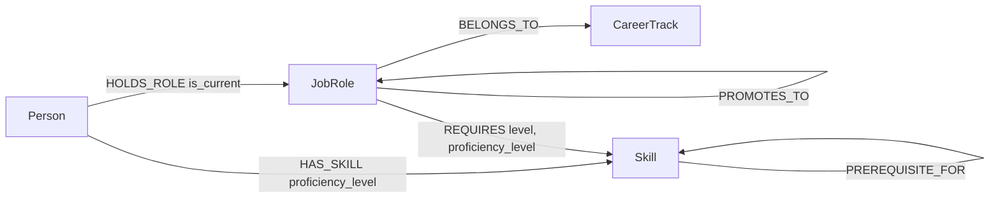

# PathGraph — Career Path Navigator (Backend)

**A graph-native API for discovering optimal software engineering career progression.**

Built with **FastAPI** on top of **CognoDB** (openCypher over Bolt) as the sole data layer.

🔗 **Live API:** https://pathgraph-backend.onrender.com — [`/docs`](https://pathgraph-backend.onrender.com/docs) for interactive Swagger UI
🔗 **Frontend repo:** https://github.com/OkuekhamhenEromose/pathgraph-frontend
🔗 **Live app:** _add your Vercel URL here_

> Built for the Wexa AI CognoDB take-home assignment. This README covers the backend/API and data model. See the [frontend repo](https://github.com/OkuekhamhenEromose/pathgraph-frontend) for the client.

---

## Table of contents

- [Problem](#problem)
- [Why a graph database?](#why-a-graph-database)
- [Data model](#data-model)
- [Tech stack](#tech-stack)
- [Project structure](#project-structure)
- [Setup & run](#setup--run)
- [API reference](#api-reference)
- [Key queries explained](#key-queries-explained)
- [Error handling](#error-handling)
- [Testing](#testing)
- [Deployment](#deployment)
- [Screenshots](#screenshots)

---

## Problem

Software engineers struggle to understand what skills they need to acquire to transition between roles. Career ladders are opaque, skill dependencies are non-linear, and "what should I learn next?" is a relationship question, not a table lookup.

**Example:** A Senior Backend Engineer wants to become a Staff Backend Engineer. Answering that well requires knowing:
- the promotion path (Senior → Staff → Principal),
- the skills required at the target level (System Design, Distributed Systems),
- the prerequisites for those skills (Microservices → System Design → Distributed Systems),
- and which of those the person already has versus is missing.

This is a **network traversal problem**, not a CRUD problem.

## Why a graph database?

| Concept | Relationship type | Natural structure |
|---|---|---|
| Career progression | `PROMOTES_TO` | Directed graph of roles |
| Skill dependencies | `PREREQUISITE_FOR` | DAG of learning order |
| Role requirements | `REQUIRES` | Bipartite graph: roles ↔ skills |
| Person capabilities | `HAS_SKILL` | Person ↔ skill affinity network |
| Track membership | `BELONGS_TO` | Hierarchical classification |
| Current role | `HOLDS_ROLE` | Person ↔ role, flagged `is_current` |

Every core user question is a traversal, not a lookup:

- *"What's the path from A to B?"* → shortest path over `PROMOTES_TO`
- *"What am I missing?"* → set difference over transitive skill requirements
- *"What should I learn first?"* → prerequisite depth over the `PREREQUISITE_FOR` DAG

CognoDB lets these be expressed as single, readable Cypher statements. A relational schema can *store* the same roles and skills, but every one of these questions turns into a hand-rolled recursive CTE, an anti-join, and manual path reconstruction — the query stops reading like the question being asked.

### Query comparison: shortest career path

**"I'm a Senior Backend Engineer — what's the path to Principal?"**

CognoDB / Cypher (this repo, `graph_repository.py`):

```cypher
MATCH path = shortestPath(
    (start:JobRole {id: $from_role_id})-[:PROMOTES_TO*1..10]->(end:JobRole {id: $to_role_id})
)
RETURN [node in nodes(path) | node {.*}] as roles,
       [rel in relationships(path) | rel {.*}] as promotions,
       length(path) as num_steps
```

Equivalent in PostgreSQL — a recursive CTE that manually tracks the visited-node array to avoid cycles, then has to reconstruct the path after the fact:

```sql
WITH RECURSIVE career_path AS (
    SELECT from_role_id, to_role_id, 1 AS hop, ARRAY[from_role_id] AS path
    FROM role_progressions WHERE from_role_id = 'r-008'
    UNION ALL
    SELECT rp.from_role_id, rp.to_role_id, cp.hop + 1, cp.path || rp.from_role_id
    FROM role_progressions rp
    JOIN career_path cp ON rp.from_role_id = cp.to_role_id
    WHERE rp.to_role_id != ALL(cp.path) AND cp.hop < 10
)
SELECT path || to_role_id AS full_path, hop AS num_hops
FROM career_path WHERE to_role_id = 'r-010' ORDER BY hop LIMIT 1;
```

Both return an answer. Only one of them reads like the question.

### Query comparison: skill gap analysis (relationally awkward)

**"What's missing for this person to reach this role — including missing prerequisites?"**

This is the query a relational database handles worst, because it chains *three* graph-shaped problems back to back: role requirements, prerequisite depth, and a negative join against what the person already knows. In Cypher it's one coherent traversal (`graph_repository.get_person_skill_gaps`):

```cypher
MATCH (target:JobRole {id: $target_role_id})-[req:REQUIRES {level: 'required'}]->(req_skill:Skill)
WHERE NOT (:Person {id: $person_id})-[:HAS_SKILL]->(req_skill)

OPTIONAL MATCH (prereq:Skill)-[:PREREQUISITE_FOR*1..3]->(req_skill)
WHERE NOT (:Person {id: $person_id})-[:HAS_SKILL]->(prereq)

WITH req_skill, req, collect(DISTINCT prereq) as prereq_nodes
RETURN req_skill, req.level as required_level, req.proficiency_level as required_proficiency,
       [p in prereq_nodes WHERE p IS NOT NULL | {name: p.name, id: p.id}] as prerequisites,
       size([p in prereq_nodes WHERE p IS NOT NULL]) as prereq_count
ORDER BY prereq_count DESC, req_skill.difficulty ASC
```

In PostgreSQL, the same answer needs a recursive CTE for role requirements, a second recursive CTE for prerequisite chains, an anti-join for skills the person already holds, and a window function to order by dependency depth — four separate constructs standing in for one traversal.

We're not claiming graph databases are universally superior — for entity storage with simple lookups, a relational table is often simpler. The claim is narrower: for a domain defined by connected entities, promotion chains, and dependency graphs, a graph model is the natural fit, and this assignment's use case sits squarely in that territory.

## Data model



**Nodes**

| Label | Key properties |
|---|---|
| `JobRole` | `id`, `title`, `level`, `category`, `description`, `typical_years_experience` |
| `Skill` | `id`, `name`, `category`, `description`, `difficulty` |
| `Person` | `id`, `name` |
| `CareerTrack` | `id`, `name`, `description` |

**Relationships**

| Type | From → To | Properties | Meaning |
|---|---|---|---|
| `PROMOTES_TO` | JobRole → JobRole | — | Directed promotion edge between adjacent levels |
| `REQUIRES` | JobRole → Skill | `level` (`required`/`preferred`), `proficiency_level` | A role's skill requirements |
| `PREREQUISITE_FOR` | Skill → Skill | — | Learning-order dependency between skills |
| `HAS_SKILL` | Person → Skill | `proficiency_level` | What a person currently knows |
| `HOLDS_ROLE` | Person → JobRole | `is_current` | A person's role history, current role flagged |
| `BELONGS_TO` | JobRole → CareerTrack | — | Groups roles into IC / Management tracks |

Seed data (`scripts/seed.py`) loads two career tracks (Individual Contributor, Engineering Management), 18 job roles spanning frontend/backend/data/management ladders, dozens of skills across language/framework/database/paradigm/tool/soft-skill categories with prerequisite chains, and example people with realistic skill sets and current roles.

## Tech stack

- **FastAPI** — async Python web framework, auto-generated OpenAPI docs at `/docs`
- **CognoDB** — managed graph database, openCypher over Bolt 5.x
- **Official Neo4j Python driver** — no custom SDK, parameterized queries throughout
- **Pydantic / pydantic-settings** — request/response models, fail-fast env var validation
- **structlog** — structured logging
- **pytest / httpx** — test suite

## Project structure

```
app/
├── core/
│   ├── config.py           # Settings loaded from env vars, fails fast if missing
│   ├── exceptions.py        # NotFoundError, DatabaseError
│   └── logging_config.py
├── database/
│   └── connection.py        # Neo4j driver lifecycle
├── dependencies/
│   └── database.py          # FastAPI dependency: session-per-request
├── models/                  # Pydantic request/response schemas
│   ├── job_role.py
│   ├── path.py
│   ├── skill.py
│   └── track.py
├── repositories/
│   └── graph_repository.py  # The ONLY layer that writes Cypher — all parameterized
├── routers/                 # Thin HTTP layer, one file per resource
│   ├── health.py
│   ├── paths.py
│   ├── persons.py
│   ├── roles.py
│   ├── skills.py
│   └── tracks.py
├── services/                 # Business logic between routers and repository
└── main.py                   # App factory: lifespan, CORS, exception handlers, routers
scripts/
└── seed.py                   # Idempotent seed script — run once against a fresh instance
tests/
├── test_api/                 # Endpoint tests, including database-unavailable simulation
└── test_services/
```

## Setup & run

### 1. Create a CognoDB instance

1. Sign up at [console.cognodb.com/signup](https://console.cognodb.com/signup) — no credit card required.
2. Create a free **c0** instance, pick a region. Provisions in under a minute.
3. Copy the connection URI (`bolt+s://<instance-id>.databases.cognodb.cloud`) and the generated password for user `cognodb` — **the password is shown once**, save it immediately.

### 2. Clone and configure

```bash
git clone https://github.com/OkuekhamhenEromose/pathgraph-backend.git
cd pathgraph-backend
python -m venv venv
source venv/bin/activate      # Windows: venv\Scripts\activate
pip install -r requirements.txt

cp .env.example .env
```

Edit `.env`:

```env
COGNODB_URI=bolt+s://your-instance.databases.cognodb.cloud
COGNODB_USERNAME=cognodb
COGNODB_PASSWORD=your-generated-password
APP_NAME=PathGraph
APP_ENV=development
LOG_LEVEL=INFO
FRONTEND_URL=http://localhost:5173
```

### 3. Seed the database

```bash
python scripts/seed.py
```

Loads career tracks, roles, skills, prerequisite chains, role requirements, and example people directly through the Neo4j driver using parameterized writes.

### 4. Run the API

```bash
uvicorn app.main:app --reload
```

API live at `http://localhost:8000`, interactive docs at `http://localhost:8000/docs`.

## API reference

All routes below are prefixed with `/api/v1` except `/health` and `/`.

| Method | Path | Description |
|---|---|---|
| `GET` | `/health` | DB connectivity check — `200 healthy` or `503 degraded` |
| `GET` | `/roles` | List all job roles |
| `GET` | `/roles/{role_id}` | Role detail + its required skills |
| `GET` | `/skills` | List all skills |
| `GET` | `/skills/{skill_id}` | Skill detail + full prerequisite chains (multi-hop) |
| `GET` | `/tracks` | List all career tracks |
| `GET` | `/tracks/{track_id}` | Track detail + all roles in that track |
| `GET` | `/persons` | List all people with current role |
| `GET` | `/persons/{person_id}` | Person detail |
| `GET` | `/persons/{person_id}/skills` | Skills held by a person |
| `GET` | `/paths/career?from_role_id=&to_role_id=` | Shortest promotion path (**multi-hop**) |
| `GET` | `/paths/skill-gaps/{person_id}?target_role_id=` | Missing skills + missing prerequisites (**relationally awkward**) |

## Key queries explained

- **Multi-hop traversal — skill prerequisites** (`get_skill_prerequisites`): walks `PREREQUISITE_FOR*1..5` to find every chain of prerequisite skills feeding into a target skill, returning full paths with depth.
- **Multi-hop traversal — career path** (`find_career_path`): uses CognoDB's native `shortestPath()` over `PROMOTES_TO*1..10` to find the shortest promotion route between any two roles, including intermediate roles and the promotion edges themselves.
- **Relationally awkward — skill gap analysis** (`get_person_skill_gaps`): combines a role's required skills, a negative match against what the person already has, and a second-order prerequisite lookup on the *missing* skills — all in one traversal, ordered by prerequisite depth as a topological approximation.

Every query above is parameterized (`$role_id`, `$person_id`, etc.) — there is no string-concatenated Cypher anywhere in `graph_repository.py`.

## Error handling

The app is designed to degrade gracefully rather than crash when CognoDB is unreachable:

- On startup, a failed connectivity check is **logged, not raised** — the app still boots so `/health` can report `degraded` instead of the process refusing to start.
- `DatabaseError` → `503` with a generic, non-leaking message (`"Career data is temporarily unavailable"`).
- `NotFoundError` → `404` with a structured `{error: {code, message}}` body.
- An unhandled-exception handler catches everything else and returns a generic `500` rather than a stack trace.

Covered explicitly in `tests/test_api/test_database_unavailable.py`.

## Testing

```bash
pytest
```

Covers endpoint behavior (`test_api/`) — including the database-unavailable path — and service-layer logic (`test_services/`) for path-finding.

## Deployment

Deployed on **Render** (free tier):

- Root/start command: `uvicorn app.main:app --host 0.0.0.0 --port $PORT`
- Environment variables (`COGNODB_URI`, `COGNODB_USERNAME`, `COGNODB_PASSWORD`, `FRONTEND_URL`) set in the Render dashboard, never committed.
- `.python-version` pins the build to Python 3.12 for prebuilt wheel compatibility.

Note: Render's free tier sleeps after inactivity — the first request after idle can take 20–50 seconds while it wakes up.

## Screenshots

_Add screenshots of `/docs` (Swagger UI) and a couple of live API responses here before submission._

---

Built by [Okuekhamhen Eromose](https://github.com/OkuekhamhenEromose) for the Wexa AI CognoDB take-home assignment.
